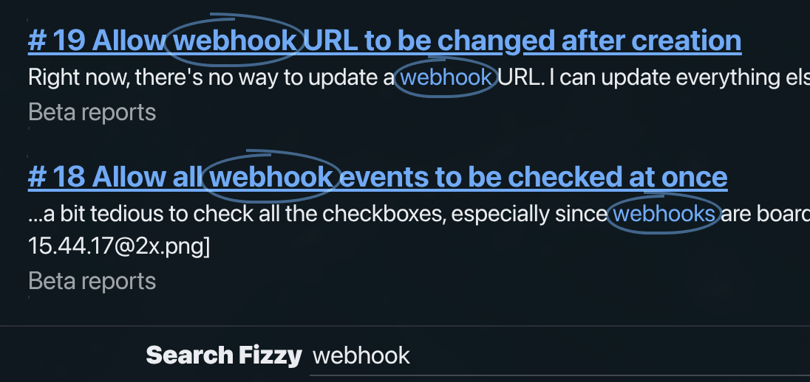

# 原生 CSS 就是你所需要的一切

> 原文：[Vanilla CSS is all you need](https://www.zolkos.com/2025/12/03/vanilla-css-is-all-you-need)

2024 年 4 月，来自 [37signals](https://37signals.com/) 的 [Jason Zimdars](https://x.com/jasonzimdars) 发表了一篇关于 [Campfire 中的现代 CSS 模式](https://dev.37signals.com/modern-css-patterns-and-techniques-in-campfire/)的文章。他解释了他们的团队如何仅使用原生 CSS 来构建复杂的 Web 应用程序。没有 Sass，没有 PostCSS，没有构建工具。

那篇文章一直萦绕在我心头。在过去的一年半里，37signals 又发布了两款产品（Writebook 和 Fizzy），都基于同样的"无构建"理念。我想知道这些模式是否经得住考验。它们有没有演进？

<!--more-->

我打开了 Campfire、Writebook 和 Fizzy 的源代码，追溯了它们 CSS 架构的演变。最初只是好奇，最终变成了真正的惊叹。这些不仅仅是一致的模式，它们是**不断改进的**模式。每个版本都在上一个版本的基础上构建，逐步采用更现代的 CSS 特性，同时保持相同的无构建理念。

这些不是业余项目。[Campfire](https://github.com/basecamp/once-campfire) 是一个实时聊天应用。[Writebook](https://once.com/writebook) 是一个出版平台。[Fizzy](https://fizzy.do) 是一个功能完备的项目管理工具，拥有看板、拖放和复杂的状态管理。三者加在一起，代表了 105 个文件中近 **14,000 行 CSS** 代码。

没有一行代码经过构建工具处理。

---

## Tailwind 之问

我要明确说明：**[Tailwind](https://tailwindcss.com/) 没有任何问题**。它是一个出色的工具，帮助开发者更快地交付产品。实用优先的方法很务实，特别是对于在 CSS 架构决策上有困难的团队。

但不知从何时起，实用优先变成了唯一的答案。CSS 已经发生了巨大的演进。曾经需要预处理器来实现变量和嵌套的语言，如今已经拥有：

- 原生[自定义属性](https://developer.mozilla.org/en-US/docs/Web/CSS/Using_CSS_custom_properties)（变量）
- 原生[嵌套](https://developer.mozilla.org/en-US/docs/Web/CSS/CSS_nesting)
- [容器查询](https://developer.mozilla.org/en-US/docs/Web/CSS/CSS_container_queries)
- [`:has()` 选择器](https://developer.mozilla.org/en-US/docs/Web/CSS/:has)（终于有了父选择器）
- [CSS 层](https://developer.mozilla.org/en-US/docs/Web/CSS/@layer)用于管理优先级
- [`color-mix()`](https://developer.mozilla.org/en-US/docs/Web/CSS/color_value/color-mix) 用于动态颜色操作
- [`clamp()`](https://developer.mozilla.org/en-US/docs/Web/CSS/clamp)、`min()`、`max()` 用于无需媒体查询的响应式尺寸

37signals 审视了这一格局，做出了一个赌注：现代 CSS 足够强大，不需要构建步骤。

三款产品之后，这个赌注正在获得回报。

---

## 架构：简单到令人尴尬

打开这三个代码库中的任何一个，你都会发现相同的扁平结构：

```
app/assets/stylesheets/
├── _reset.css
├── base.css
├── colors.css
├── utilities.css
├── buttons.css
├── inputs.css
├── [component].css
└── ...
```

就是这样。没有子目录，没有局部文件，没有复杂的导入树。每个文件对应一个概念，名字就是它的功能。

零配置。零构建时间。零等待。

我很希望看到类似的东西能随新的 Rails 应用一起提供。一个简单的起始结构，`_reset.css`、`base.css`、`colors.css` 和 `utilities.css` 已经就位。我怀疑很多开发者选择 Tailwind 不是因为他们更喜欢实用类，而是因为原生 CSS 没有提供起点。没有分类，没有约定。也许 CSS 也需要自己的 omakase（主厨推荐）。

---

## 颜色系统：一致的基础，不断演进的能力

Jason 的原始文章很好地解释了 [OKLCH](https://developer.mozilla.org/en-US/docs/Web/CSS/color_value/oklch)。它是这三个应用都使用的感知均匀色彩空间。简单来说：与 RGB 或 HSL 不同，OKLCH 的亮度值实际上对应于感知亮度。50% 亮度的蓝色看起来和 50% 亮度的黄色一样明亮。

值得注意的是，这个基础在三个应用中保持**完全相同**：

```css
:root {
  /* 原始 LCH 值：亮度、色度、色相 */
  --lch-blue: 54% 0.15 255;
  --lch-red: 51% 0.2 31;
  --lch-green: 65% 0.23 142;

  /* 基于原语构建的语义颜色 */
  --color-link: oklch(var(--lch-blue));
  --color-negative: oklch(var(--lch-red));
  --color-positive: oklch(var(--lch-green));
}
```

暗色模式变得轻而易举：

```css
@media (prefers-color-scheme: dark) {
  :root {
    --lch-blue: 72% 0.16 248;   /* 更亮，略微降低饱和度 */
    --lch-red: 74% 0.18 29;
    --lch-green: 75% 0.20 145;
  }
}
```

每个引用这些原语的颜色都会自动更新。没有重复，没有单独的暗色主题文件。一个媒体查询，整个应用就完成了切换。

Fizzy 通过 `color-mix()` 更进一步：

```css
.card {
  --card-color: oklch(var(--lch-blue-dark));

  /* 从一个变量派生出整个色板 */
  --card-bg: color-mix(in srgb, var(--card-color) 4%, var(--color-canvas));
  --card-text: color-mix(in srgb, var(--card-color) 30%, var(--color-ink));
  --card-border: color-mix(in srgb, var(--card-color) 33%, transparent);
}
```

一个颜色输入，四个和谐的颜色输出。通过 JavaScript 更改卡片颜色（`element.style.setProperty('--card-color', '...')`），整个卡片主题就会自动更新。无需切换类名，无需重新计算样式。只是 CSS 在做它最擅长的事。

---

## 间距系统：字符，而非像素

这是一个我没预料到的模式：三个应用都使用 `ch` 单位作为水平间距。

```css
:root {
  --inline-space: 1ch;      /* 水平方向：一个字符宽度 */
  --block-space: 1rem;      /* 垂直方向：一个根 em */
}

.component {
  padding-inline: var(--inline-space);
  margin-block: var(--block-space);
}
```

为什么用字符？因为间距应该与内容相关。单词之间 `1ch` 的间隙感觉很自然，因为它就是一个字符的宽度。随着字体大小缩放，间距也会按比例缩放。

这也使得他们的响应式断点出乎意料地优雅：

```css
@media (min-width: 100ch) {
  /* 桌面端：内容足够宽，可以放侧边栏 */
}
```

他们不是在问"这是平板吗？"，而是在问"有没有空间容纳 100 个字符的内容？"这是语义化的，是内容驱动的，而且它有效。

---

## 实用类：是的，它们仍然存在

让我来说说房间里的大象。这些应用确实使用了实用类：

```css
/* 来自 utilities.css */
.flex { display: flex; }
.gap { gap: var(--inline-space); }
.pad { padding: var(--block-space) var(--inline-space); }
.txt-large { font-size: var(--text-large); }
.hide { display: none; }
```

区别在哪里？这些实用类是**补充性的**，而不是基础性的。核心样式存在于语义化的组件类中。实用类处理的是例外情况：一次性的布局调整、条件性的可见性切换。

与典型的 Tailwind 组件进行对比：

```html
<!-- Tailwind 方式 -->
<button class="inline-flex items-center gap-2 px-4 py-2 rounded-full
               border border-gray-300 bg-white text-gray-900
               hover:bg-gray-50 focus:ring-2 focus:ring-blue-500">
  保存
</button>
```

以及 37signals 的等效写法：

```html
<!-- 语义化方式 -->
<button class="btn">保存</button>
```

```css
.btn {
  --btn-padding: 0.5em 1.1em;
  --btn-border-radius: 2em;

  display: inline-flex;
  align-items: center;
  gap: 0.5em;
  padding: var(--btn-padding);
  border-radius: var(--btn-border-radius);
  border: 1px solid var(--color-border);
  background: var(--btn-background, var(--color-canvas));
  color: var(--btn-color, var(--color-ink));
  transition: filter 100ms ease;
}

.btn:hover {
  filter: brightness(0.95);
}

.btn--negative {
  --btn-background: var(--color-negative);
  --btn-color: white;
}
```

是的，CSS 更多了。但想想你得到了什么：

1. **HTML 保持可读。** `class="btn btn--negative"` 告诉你某个东西*是什么*，而不是它*看起来怎样*。
2. **修改会级联。** 更新一次 `--btn-padding`，所有按钮都会更新。
3. **变体可以组合。** 添加 `.btn--circle` 而无需重新定义每个属性。
4. **媒体查询与组件共存。** 暗色模式、悬停状态和响应式行为与它们所影响的组件放在一起。

---

## :has() 革命

如果有一个 CSS 特性能改变一切，那就是 `:has()`。几十年来，你需要 JavaScript 来根据子元素设置父元素样式。现在不需要了。

Writebook 用它实现了无需 JavaScript 的侧边栏切换：

```css
/* 当隐藏的复选框被选中时，显示侧边栏 */
:has(#sidebar-toggle:checked) #sidebar {
  margin-inline-start: 0;
}
```

Fizzy 用它实现看板列布局：

```css
.card-columns {
  grid-template-columns: 1fr var(--column-width) 1fr;
}

/* 当任何列被展开时，调整网格 */
.card-columns:has(.cards:not(.is-collapsed)) {
  grid-template-columns: auto var(--column-width) auto;
}
```

Campfire 用它实现智能按钮样式：

```css
/* 当按钮只包含图标和屏幕阅读器文本时，变成圆形 */
.btn:where(:has(.for-screen-reader):has(img)) {
  --btn-border-radius: 50%;
  aspect-ratio: 1;
}

/* 当内部复选框被选中时高亮 */
.btn:has(input:checked) {
  --btn-background: var(--color-ink);
  --btn-color: var(--color-ink-reversed);
}
```

这就是 CSS 在做过去需要 JavaScript 才能做的事。状态管理、条件渲染、父元素选择。全部声明式，全部在样式表中。

---

## 演进

最令我着迷的是观察架构在不同版本之间的演变。

**Campfire**（首发版本）奠定了基础：
- OKLCH 颜色
- 万物皆自定义属性
- 基于字符的间距
- 扁平文件组织
- [视图过渡 API](https://developer.mozilla.org/en-US/docs/Web/API/View_Transitions_API) 实现平滑的页面切换

**Writebook**（第二个版本）增加了现代功能：
- 容器查询实现组件级响应式
- [`@starting-style`](https://developer.mozilla.org/en-US/docs/Web/CSS/@starting-style) 实现入场动画

**Fizzy**（第三个版本）全面拥抱现代 CSS：
- CSS 层（`@layer`）管理优先级
- `color-mix()` 实现动态颜色派生
- 复杂的 `:has()` 链取代 JavaScript 状态管理

你可以看到一个团队在每个产品中学习、实验，并交付越来越复杂的 CSS。到了 Fizzy，他们使用的特性是许多开发者甚至不知道存在的。

```css
/* Fizzy 的层架构 */
@layer reset, base, components, modules, utilities;

@layer components {
  .btn { /* 优先级始终低于 utilities */ }
}

@layer utilities {
  .hide { /* 始终胜过 components */ }
}
```

CSS 层解决了自 CSS 诞生以来就困扰着开发者的优先级大战。文件加载顺序无关紧要，类名链的数量也无关紧要。层决定了胜者，就这么简单。

---

## 加载动画

有一个技术出现在所有三个应用中，值得特别关注。它们的加载动画不使用图片、不使用 SVG、不使用 JavaScript。只用 CSS 遮罩。

以下是 Fizzy 的 `spinners.css` 中的实际实现：

```css
@layer components {
  .spinner {
    position: relative;

    &::before {
      --mask: no-repeat radial-gradient(#000 68%, #0000 71%);
      --dot-size: 1.25em;

      -webkit-mask: var(--mask), var(--mask), var(--mask);
      -webkit-mask-size: 28% 45%;
      animation: submitting 1.3s infinite linear;
      aspect-ratio: 8/5;
      background: currentColor;
      content: "";
      inline-size: var(--dot-size);
      inset: 50% 0.25em;
      margin-block: calc((var(--dot-size) / 3) * -1);
      margin-inline: calc((var(--dot-size) / 2) * -1);
      position: absolute;
    }
  }
}
```

关键帧动画定义在单独的 `animation.css` 文件中：

```css
@keyframes submitting {
  0%    { -webkit-mask-position: 0% 0%,   50% 0%,   100% 0% }
  12.5% { -webkit-mask-position: 0% 50%,  50% 0%,   100% 0% }
  25%   { -webkit-mask-position: 0% 100%, 50% 50%,  100% 0% }
  37.5% { -webkit-mask-position: 0% 100%, 50% 100%, 100% 50% }
  50%   { -webkit-mask-position: 0% 100%, 50% 100%, 100% 100% }
  62.5% { -webkit-mask-position: 0% 50%,  50% 100%, 100% 100% }
  75%   { -webkit-mask-position: 0% 0%,   50% 50%,  100% 100% }
  87.5% { -webkit-mask-position: 0% 0%,   50% 0%,   100% 50% }
  100%  { -webkit-mask-position: 0% 0%,   50% 0%,   100% 0% }
}
```

三个点依次弹跳：

<style>
.demo-spinner {
  display: inline-block;
  position: relative;
  width: 1.5em;
  height: 1em;
}
.demo-spinner::before {
  --mask: no-repeat radial-gradient(#000 68%, #0000 71%);
  --dot-size: 1.25em;
  -webkit-mask: var(--mask), var(--mask), var(--mask);
  -webkit-mask-size: 28% 45%;
  animation: demo-submitting 1.3s infinite linear;
  aspect-ratio: 8/5;
  background: currentColor;
  content: "";
  inline-size: var(--dot-size);
  inset: 50% 0.25em;
  margin-block: calc((var(--dot-size) / 3) * -1);
  margin-inline: calc((var(--dot-size) / 2) * -1);
  position: absolute;
}
@keyframes demo-submitting {
  0%    { -webkit-mask-position: 0% 0%,   50% 0%,   100% 0% }
  12.5% { -webkit-mask-position: 0% 50%,  50% 0%,   100% 0% }
  25%   { -webkit-mask-position: 0% 100%, 50% 50%,  100% 0% }
  37.5% { -webkit-mask-position: 0% 100%, 50% 100%, 100% 50% }
  50%   { -webkit-mask-position: 0% 100%, 50% 100%, 100% 100% }
  62.5% { -webkit-mask-position: 0% 50%,  50% 100%, 100% 100% }
  75%   { -webkit-mask-position: 0% 0%,   50% 50%,  100% 100% }
  87.5% { -webkit-mask-position: 0% 0%,   50% 0%,   100% 50% }
  100%  { -webkit-mask-position: 0% 0%,   50% 0%,   100% 0% }
}
</style>

<p style="text-align: center; font-size: 2rem; padding: 1.5rem 0;">
  <span class="demo-spinner"></span>
</p>

`background: currentColor` 意味着它会自动继承文本颜色。在任何上下文、任何主题、任何配色方案中都能工作。零额外资源。纯粹的 CSS 创意。

---

## 更好的 `<mark>`

浏览器默认的 `<mark>` 元素渲染为黄色荧光笔效果。可以用，但不够优雅。Fizzy 对搜索结果高亮采用了不同的方式：在匹配的词汇周围画一个手绘圆圈。



以下是 `circled-text.css` 中的实现：

```css
@layer components {
  .circled-text {
    --circled-color: oklch(var(--lch-blue-dark));
    --circled-padding: -0.5ch;

    background: none;
    color: var(--circled-color);
    position: relative;
    white-space: nowrap;

    span {
      opacity: 0.5;
      mix-blend-mode: multiply;

      @media (prefers-color-scheme: dark) {
        mix-blend-mode: screen;
      }
    }

    span::before,
    span::after {
      border: 2px solid var(--circled-color);
      content: "";
      inset: var(--circled-padding);
      position: absolute;
    }

    span::before {
      border-inline-end: none;
      border-radius: 100% 0 0 75% / 50% 0 0 50%;
      inset-block-start: calc(var(--circled-padding) / 2);
      inset-inline-end: 50%;
    }

    span::after {
      border-inline-start: none;
      border-radius: 0 100% 75% 0 / 0 50% 50% 0;
      inset-inline-start: 30%;
    }
  }
}
```

HTML 结构是 `<mark class="circled-text"><span></span>webhook</mark>`。空的 `span` 仅仅是为了提供两个伪元素（`::before` 和 `::after`），用来绘制圆圈的左半部分和右半部分。

这个技术使用不对称的 border-radius 值来创造有机的、手绘的外观。`mix-blend-mode: multiply` 使圆圈相对于背景半透明，在暗色模式下切换为 `screen` 以实现正确的混合效果。

<style>
.demo-circled-text {
  --circled-color: oklch(57.02% 0.1895 260.46);
  --circled-padding: -0.5ch;
  background: none;
  color: var(--circled-color);
  position: relative;
  white-space: nowrap;
}
.demo-circled-text span {
  opacity: 0.5;
  mix-blend-mode: multiply;
}
@media (prefers-color-scheme: dark) {
  .demo-circled-text span {
    mix-blend-mode: screen;
  }
  .demo-circled-text {
    --circled-color: oklch(74% 0.1293 256);
  }
}
.demo-circled-text span::before,
.demo-circled-text span::after {
  border: 2px solid var(--circled-color);
  content: "";
  inset: var(--circled-padding);
  position: absolute;
}
.demo-circled-text span::before {
  border-inline-end: none;
  border-radius: 100% 0 0 75% / 50% 0 0 50%;
  inset-block-start: calc(var(--circled-padding) / 2);
  inset-inline-end: 50%;
}
.demo-circled-text span::after {
  border-inline-start: none;
  border-radius: 0 100% 75% 0 / 0 50% 50% 0;
  inset-inline-start: 30%;
}
</style>

<p style="text-align: center; font-size: 1.25rem; padding: 1rem 0;">
  搜索结果：<mark class="demo-circled-text"><span></span>webhook</mark>
</p>

没有图片，没有 SVG。只是边框和 border-radius 创造出手绘圆圈的错觉。

---

## 对话框动画：新方式

Fizzy 和 Writebook 都对 HTML `<dialog>` 元素添加了动画。这在以前是出了名的困难。秘诀就是 `@starting-style`。

以下是 Fizzy 的 `dialog.css` 中的实际实现：

```css
@layer components {
  :is(.dialog) {
    border: 0;
    opacity: 0;
    transform: scale(0.2);
    transform-origin: top center;
    transition: var(--dialog-duration) allow-discrete;
    transition-property: display, opacity, overlay, transform;

    &::backdrop {
      background-color: var(--color-black);
      opacity: 0;
      transform: scale(1);
      transition: var(--dialog-duration) allow-discrete;
      transition-property: display, opacity, overlay;
    }

    &[open] {
      opacity: 1;
      transform: scale(1);

      &::backdrop {
        opacity: 0.5;
      }
    }

    @starting-style {
      &[open] {
        opacity: 0;
        transform: scale(0.2);
      }

      &[open]::backdrop {
        opacity: 0;
      }
    }
  }
}
```

`--dialog-duration` 变量全局定义为 `150ms`。

<style>
.demo-dialog {
  border: 0;
  border-radius: 0.5rem;
  padding: 2rem;
  opacity: 0;
  transform: scale(0.2);
  transform-origin: top center;
  transition: 150ms allow-discrete;
  transition-property: display, opacity, overlay, transform;
}
.demo-dialog::backdrop {
  background-color: #000;
  opacity: 0;
  transition: 150ms allow-discrete;
  transition-property: display, opacity, overlay;
}
.demo-dialog[open] {
  opacity: 1;
  transform: scale(1);
}
.demo-dialog[open]::backdrop {
  opacity: 0.5;
}
@starting-style {
  .demo-dialog[open] {
    opacity: 0;
    transform: scale(0.2);
  }
  .demo-dialog[open]::backdrop {
    opacity: 0;
  }
}
.demo-dialog-btn {
  padding: 0.5em 1em;
  border: 1px solid #ccc;
  border-radius: 0.25rem;
  background: #f5f5f5;
  cursor: pointer;
}
.demo-dialog-btn:hover {
  background: #e5e5e5;
}
</style>

<p style="text-align: center; padding: 1rem 0;">
  <button class="demo-dialog-btn" onclick="document.getElementById('demo-modal').showModal()">打开对话框</button>
</p>

<dialog id="demo-modal" class="demo-dialog">
  <p style="margin: 0 0 1rem 0;">这个对话框使用纯 CSS 实现进出动画。</p>
  <button class="demo-dialog-btn" onclick="document.getElementById('demo-modal').close()">关闭</button>
</dialog>

`@starting-style` 规则定义了元素出现时动画的起始位置。结合 `allow-discrete`，你现在可以在 `display: none` 和 `display: block` 之间进行过渡。模态框平滑地缩放和淡入，背景遮罩独立淡入。没有 JavaScript 动画库，没有手动切换类名。浏览器会处理一切。

---

## 这对你意味着什么

我不是建议你明天就抛弃构建工具。但我建议你重新审视自己的假设。

**你可能不需要 Sass 或 PostCSS。** 原生 CSS 已经有了变量、嵌套和 `color-mix()`。那些曾经需要 polyfill 的特性现在已经是所有浏览器的基线支持了。

**你可能不是每个项目都需要 Tailwind。** 特别是如果你的团队对 CSS 的理解足以构建一个小型设计系统。

当整个行业朝着越来越复杂的工具链冲刺时，37signals 正在平静地向相反的方向前行。这种方式适合所有人吗？不。CSS 技能水平参差不齐的大型团队可能会受益于 Tailwind 的护栏。但对于许多项目来说，他们的方式是一个提醒：更简单可以更好。

---

*感谢 [Jason Zimdars](https://x.com/jasonzimdars) 和 37signals 团队公开分享他们的方法。本文中所有代码示例均取自 Campfire、Writebook 和 Fizzy 的源代码。如需了解 Jason 对 Campfire CSS 模式的原始深度解析，请参阅 [Campfire 中的现代 CSS 模式与技术](https://dev.37signals.com/modern-css-patterns-and-techniques-in-campfire/)。如果你想学习现代 CSS，这三个代码库是绝佳的课堂。*
